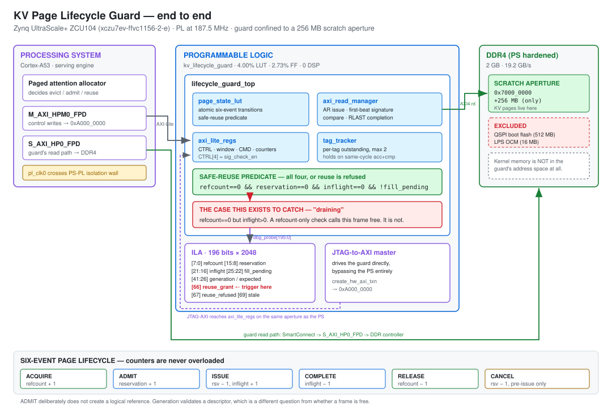

# KV Page Lifecycle Guard for LLM Inference on ZCU104

A hardware safety interlock that makes it **impossible for a KV cache page to be
reused while a transaction is still reading it.**

Serving engines page KV cache in and out of memory constantly. When a page is
evicted and its frame is recycled while an in-flight read is still outstanding,
the returning data lands in a frame that now belongs to someone else. The symptom
is silent: no crash, no error code, just a token stream that is subtly wrong.
Software can avoid this with careful reference counting. This project asks whether
the fabric can make it structurally unreachable instead.

**Status: verified in simulation AND on hardware.** The safety property was
demonstrated on a ZCU104 with an ILA capture. Every claim below is labelled
MEASURED or NOT RUN.



---

## Verified results

### Simulation, MEASURED

| testbench | DUT | checks | failures |
|---|---|---|---|
| `tb_page_state_lut` | `page_state_lut` | 23 | 0 |
| `tb_payload_corruption` | `page_state_lut` | 31 | 0 |
| `tb_lifecycle_guard_top` | `lifecycle_guard_top` (full AXI) | 25 | 0 |
| **total** | | **79** | **0** |

### Synthesis, MEASURED

Strategy `Flow_PerfOptimized_high`, 29 s. Four debug cores reached the netlist:
`dbg_hub`, `ila_lifecycle`, `jtag_axi_0`, `sila_axi/inst/ila_lib`.

| resource | used | available | % |
|---|---|---|---|
| CLB LUTs | 15,976 | 230,400 | 6.93 |
| CLB Registers | 22,477 | 460,800 | 4.88 |
| Block RAM tiles | 26 | 312 | 8.33 |
| URAM | 0 | 96 | 0.00 |
| DSPs | 0 | 1,728 | 0.00 |

Debug hub: `C_CLK_INPUT_FREQ_HZ 187500000`, `C_ENABLE_CLK_DIVIDER false`,
`C_USER_SCAN_CHAIN 1`. The divider must be **false** here; see the engineering log.


### Implementation on xczu7ev-ffvc1156-2-e, MEASURED

Strategy `Performance_ExplorePostRoutePhysOpt`, 4 min 34 s.

| metric | value |
|---|---|
| Clock | 187.5 MHz granted (IOPLL/8; 200 MHz requested is not a reachable divisor) |
| WNS | +0.242432 ns (4.5% of the 5.333 ns period) |
| TNS | 0.000 ns |
| WHS | +0.009976 ns |
| THS | 0.000 ns |
| TPWS | 0.000 ns |
| Total endpoints | 53,926, **0 failing** |
| DRC violations | 0 (13 informational warnings) |
| Methodology warnings | 9 |

| resource | used | available | % |
|---|---|---|---|
| CLB LUTs | 15,423 | 230,400 | 6.69 |
| LUT as Logic | 12,890 | 230,400 | 5.59 |
| LUT as Memory | 2,533 | 101,760 | 2.49 |
| CLB Registers | 22,745 | 460,800 | 4.94 |
| Block RAM tiles | 26 | 312 | 8.33 |
| URAM / DSPs | 0 | — | 0.00 |


#### Where the resources actually go

This matters more than the totals, because most of the design is instrumentation:

| block | LUTs | FFs | what it is |
|---|---|---|---|
| `kv_lifecycle_guard_0` | **4,996** | 5,871 | **the actual design** |
| `ila_lifecycle` | 4,533 | 7,344 | debug, 21 named probes |
| `sila_axi` | 3,297 | 5,492 | debug, System ILA on 2 AXI slots |
| `jtag_axi_0` | 623 | 1,593 | debug, PS-free control master |
| `dbg_hub` | 458 | 20 | debug, inserted by Vivado |
| `axi_smc_ctrl` | 851 | 960 | interconnect |
| `axi_smc_mem` | 657 | 687 | interconnect |

**The guard is 4,996 LUTs. Debug instrumentation is 8,911, which is 58% of the
design.** That is the correct trade for a bring-up build and the wrong one for a
release build. Strip `sila_axi` and `ila_lifecycle` and the design drops to
roughly 6,500 LUTs including interconnect.

The 4,996 figure matches the 4,980 measured out-of-context, so the guard did not
grow when integrated.

#### Power, MEASURED

| metric | value |
|---|---|
| Total on-chip | 3.628 W |
| Dynamic | 2.934 W |
| Device static | 0.693 W |
| Junction temperature | 28.6 C |
| Effective ThetaJA | 1.0 C/W |
| Confidence | Medium |

By block: PS8 2.642 W, clocks 0.113 W, signals 0.062 W. **The PS dominates at
73% of total.** The PL contribution is small, which is expected for a design
using under 7% of the fabric.

### Hardware, MEASURED

The guard's ID register reads `0x4C475031` (ASCII `LGP1`) over JTAG-AXI, so the
control path is live. Two controlled experiments, freshly programmed, counters
starting at zero:

| case | state at the reuse request | result |
|---|---|---|
| **A, positive control** | idle frame, all predicate terms 0 | **GRANTED** (grant 0 -> 1) |
| **B, draining** | `refcount == 0`, `inflight == 1` | **REFUSED** (refused 0 -> 1, grant unchanged) |

Case A matters as much as case B: a guard that refuses everything would pass a
naive test and be useless. It grants when safe and refuses when draining.

Repeated 24 times: `refused = 0x18` (24 of 24), `grant = 0`, `unsafe_commit = 0`.

The ILA triggered on `dbg_reuse_refused` via an ADVANCED trigger state machine
that fires on **either** the refusal **or** the violation condition
(`reuse_grant == 1 && inflight != 0`), so each capture classifies itself.
**Safety violations in capture: 0.**

Debug instrumentation on the board: `hw_ila_1` with 21 named per-field probes,
`hw_ila_2` a System ILA with 84 probes decoding both AXI interfaces, and
`hw_axi_1` a JTAG-AXI master driving the guard with no PS in the control path.

### Simulation versus hardware on latency

The performance counters are worth comparing across the two, because they
disagree and the disagreement is the point.

| counter | simulation | hardware |
|---|---|---|
| `dbg_rd_latency` | `0x0012` (18 cycles) | `0x0000` |
| `dbg_rd_latency_max` | `0x0012` | `0x0000` |
| `dbg_ar_wait` | `0x0000` | `0x0000` |

Simulation produced a real 18-cycle read latency because the testbench's AXI
responder returns data. On hardware the counters stay at zero because the DDR
read never completes, so RLAST never arrives and the latency window never
closes. The usual lesson is that hardware shows you what simulation cannot; here
it ran the other way, and the empty counter is the evidence that the memory path
is not yet serviced.

The lifecycle interlock does not depend on completion. `inflight` increments on
ISSUE and the safe-reuse predicate is evaluated on that, which is why the safety
result stands while latency measurement does not.


### NOT RUN

- DDR read completion. `dispatch` and `accept` reach 1 but `complete` stays 0
  and `dbg_rd_latency` reads 0, consistent with DDR not being initialised by the
  side-loaded FSBL. The lifecycle interlock does not depend on it, but the
  latency counters have no data yet.

---

## Evidence

Every figure below is a Vivado capture of the design as it currently stands.
`docs/images/README.md` says exactly what each one must show.

| gate | figure | the one thing to look for |
|---|---|---|
| Simulation | `sim-waveform.png` | `checks=25`, `errors=0` on the bench that drives the real AXI boundary |
| Simulation, counters | `sim-latency.png` | `dbg_rd_latency=0012`, `dbg_sticky=8f` |
| Block design | `block-design.png` | 21 named probes fanning into the ILA; `const_one` into both reset pins |
| Resources and power | `dashboard.png` | LUT 7%, FF 5%, BRAM 8%, 3.628 W, DRC 13, methodology 9 |
| Implementation | `device-view.png` | placed cells, timing closed |
| Project summary | `project-summary.png` | WNS 0.242, 0 failing of 53,926 |
| **Hardware** | **`ila-hardware.png`** | **`refcount=00`, `inflight` 01 to 08, `reuse_grant` flat at 0** |


The last row is the one that carries the result. Everything above it is
supporting evidence that the thing captured is the thing that was designed.

## The safety contract

A page has a six-event lifecycle. Counters are never overloaded:

| event | effect |
|---|---|
| ACQUIRE | `refcount + 1` |
| ADMIT | `reservation + 1` |
| ISSUE | `reservation - 1`, `inflight + 1` |
| COMPLETE | `inflight - 1` |
| RELEASE | `refcount - 1` |
| CANCEL | `reservation - 1` (pre-issue only) |

ADMIT deliberately does **not** create a logical reference. A frame is safe to
reuse only when

```
refcount == 0 && reservation == 0 && inflight == 0 && !fill_pending
```

Generation is **not** part of that predicate. Generation validates a *descriptor*,
which is a different question from whether a frame is free. Conflating the two is
the most common way this class of interlock is got wrong.

The interesting state is **draining**: `refcount == 0 && inflight > 0`. A
lifecycle-blind capacity check sees `refcount == 0` and calls the frame free. It
is not free. That single case is what the whole design exists to catch.

---

## Architecture

```
        ┌──────────────┐   AXI4-Lite    ┌──────────────────┐
  PS ──▶│ SmartConnect │───────────────▶│  kv_lifecycle    │
        └──────────────┘   0xA000_0000  │     _guard       │
        ┌──────────────┐                │                  │
JTAG ──▶│ JTAG-to-AXI  │───────────────▶│  page_state_lut  │
        └──────────────┘                │  tag_tracker     │
                                        │  axi_read_manager│
        ┌──────────────┐   AXI4 read    │  axi_lite_regs   │
 DDR ◀──│ SmartConnect │◀───────────────│                  │
        └──────────────┘  0x7000_0000   └────────┬─────────┘
                            +256 MB              │ dbg_probe[195:0]
                                                 ▼
                                          ┌────────────┐
                                          │    ILA     │ 2048 deep
                                          └────────────┘
```

The read master is confined to **256 MB at `0x7000_0000`**, with QSPI and OCM
excluded from its address space entirely. `assign_bd_address` grants 2 GB at
`0x0` by default, which would let the guard read anywhere in kernel memory. The
aperture is narrowed explicitly. See `docs/hil/scratch_reservation.md`, which also
covers the matching device-tree `reserved-memory` node: the address editor bounds
what the hardware **can address**, it does not stop Linux allocating there.

### The ILA probe

196 bits carrying every term of the safety predicate, so the property is directly
observable on silicon rather than inferred:

| bits | field |
|---|---|
| 7:0 | `refcount` |
| 15:8 | `reservation` |
| 21:16 | `inflight` |
| 25:22 | `fill_pending` |
| 33:26 / 41:34 | `generation` / `expected_generation` |
| 66 / 67 | `reuse_grant` / `reuse_refused` |
| 69 / 70 | `stale` / `payload_mismatch` |
| 58..62 | AXI `arvalid`/`arready`/`rvalid`/`rready`/`rlast` |

Trigger on bit 66 and inspect bits 25:0 in the same sample. A grant with any of
those nonzero falsifies the safety claim. That is the test.

---

## Build

Staged, so each gate can be inspected before the next runs:

```bash
cd vivado
vivado -mode gui -source stages/01_sim.tcl        # 79 checks
vivado -mode gui -source stages/02_bd.tcl         # block design
vivado -mode gui -source stages/03_synth.tcl      # synthesis
vivado -mode gui -source stages/04_impl.tcl       # implementation + timing
vivado -mode gui -source stages/05_bitstream.tcl  # refuses if WNS or TNS < 0
vivado -mode gui -source stages/06d_hil_drive.tcl # program, arm, drive, capture
```

Stage 5 refuses to write a bitstream unless timing is closed. Stage 3 hard-fails
if no `dbg_hub` reaches the netlist, so a silently missing ILA cannot pass.

---

## Engineering log

Every entry below is a real defect found and fixed, with the evidence that found
it. Included because the failures are more instructive than the successes.

### The testbench was testing the wrong module

`tb_payload_corruption` instantiates `page_state_lut`, a submodule. It passes 31
checks and proves nothing about the design that goes into the bitstream, which has
an AXI boundary the submodule does not have. A separate `tb_lifecycle_guard_top`
existed and had never been run. When run, it failed.

**Lesson encoded in the flow:** stage 1 sets the simulation top to
`tb_lifecycle_guard_top` explicitly. A gate that does not exercise the module
being shipped is not a gate.

### A `$display` ternary that hid a failure

```systemverilog
$display(errors == 0 ? "TB PASS" : "TB FAIL");   // WRONG
```

XSim packs the ternary into an integer and prints `23716604428765516`. A CI grep
for `TB PASS|TB FAIL` finds nothing and the run looks clean. Replaced with an
explicit `if/else` in all three testbenches.

### `tag_tracker`: same-cycle accept and complete

Two independent `if` blocks in one `always_ff`, both assigning `o_outstanding`
from its pre-update value. When an AR handshake and the RLAST of a *different*
transaction land in the same cycle, the later branch wins and the counter
**decrements instead of holding**. It then under-reads, wraps in its 2-bit width,
and wedges the read-issue path permanently with no recovery short of reset.

The existing assertion watched the counter, so it could not detect the counter
itself going wrong. Fixed to hold on coincidence, plus a second assertion on
`$countones(tag_busy)` that the corrupted counter cannot fool. An AR handshake
coinciding with an RLAST is ordinary at 187.5 MHz behind SmartConnect.

### A globally disabled comparator

`tb_lifecycle_guard_top` failed one check: payload mismatch counted 0, expected 1.
The register map was correct and the counter was wired end to end. The cause was
`axi_lite_regs.sv:427`:

```systemverilog
assign o_req_sig_check = cmd_cfg_r[5] & ctrl_sigchk;
```

The testbench set the per-command bit but never `CTRL[4]` (`sig_check_en`), so the
comparator was disabled for the entire run. Setting that one bit, with zero RTL
edits, gives 25/25. A design defect and a testbench defect look identical from the
outside; only a counter-proof separates them.

### SystemVerilog cannot be a BD module reference

```
[filemgmt 56-195] Reference contains top file of type SystemVerilog.
This type is not allowed as the top file in the reference.
```

IP Integrator rejects `.sv` as a block design module reference. Resolved with a
generated Verilog-2001 shim (`rtl/v1/kv_lifecycle_guard.v`) whose ports are
derived from the real SV header rather than transcribed by hand. The shim also
renames `clk`/`rst_n` to `aclk`/`aresetn` so IP Integrator auto-associates the
clock with both AXI interfaces, per the AXI spec.

### Address range before offset

```
[BD 41-70] The proposed address '0x7000_0000 [ 2G ]' is misaligned.
```

While the range is still 2G, Vivado demands 2G alignment. Narrow the range first,
then set the offset.

### Constraints on an open run are discarded

Setting the debug hub divider via `set_property` on a netlist from `open_run`
looks like it works and reaches nothing: implementation re-reads the checkpoint
from disk. It must be an XDC with `used_in_implementation true`. Verify with
`grep dbg_hub.xdc impl_1/runme.log`.

Separately, the divider itself should be **false** here. It exists for hubs
clocked *slower* than JTAG. At 187.5 MHz against a ~15 MHz JTAG clock the ratio is
12.5x, so enabling it is unnecessary and it stops the hub answering.

### Floorplanning made timing worse

The critical path is 76% routing, so constraining the core to adjacent clock
regions looked obvious. MEASURED result: WNS **+0.117 → +0.020 ns**, worst path
4.932 → 5.167 ns. Pulling the core together pushed the SmartConnects and ILA
further away and route delay rose. Reverted, with the measurement recorded in
`03_synth.tcl` so nobody re-enables it on a hunch.

**A disproven hypothesis is a result.**

### The one that took longest: PS-PL isolation

Symptom: `[Labtools 27-3361] The debug hub core was not detected`, while `xsct`
*did* show a debug hub on the PL tap, the device programmed cleanly, and
`get_debug_cores` on the implemented design returned both `dbg_hub` and the ILA.

Root cause: `pl_clk0` is the only clock net in the block design and must cross the
PS-PL boundary through level shifters gated by the PL power domain.
`psu_ps_pl_isolation_removal_data()` exists in the XSA's own `psu_init.c` but
**`psu_init()` never calls it.** Its only callers are in FSBL, and every guard
fails in a JTAG-side-loaded flow: no PL boot partition, not a PS-only reset, and
boot mode is SD `0xE` rather than JTAG. So `CRL_APB` gates the clock on while no
edges reach the fabric, and a hub with no clock cannot answer.

Fix, bit 23 = PL:

```tcl
mwr 0xFFD80118 0x00800000   ;# REQ_PWRUP_INT_EN.PL
mwr 0xFFD80120 0x00800000   ;# REQ_PWRUP_TRIG.PL
mrd 0xFFD80110              ;# REQ_PWRUP_STATUS, bit 23 must read 0
```

MEASURED effect on `CSU_PCAP_STATUS`: `0x80000FD2` → `0xA0002FDE`, with `PL_INIT`
and `PL_DONE` both 0 → 1. The ILA enumerated immediately afterwards.

Three registers that mislead along the way, all documented in
`docs/hil/ps_pl_isolation.md`:

- `REQ_ISO_STATUS` (`0xFFD80310`) reads 0 at reset and says nothing about
  isolation state.
- `0xFFCA0034` is `CSU_JTAG_CHAIN_STATUS` and is **read-only**, not a DAP config
  register.
- `CSU_PCAP_STATUS` bits are `b2 PL_INIT`, `b3 PL_DONE`, `b4 PL_EOS`. `PL_EOS` is
  what Vivado prints as "End of startup status: HIGH".

### The probe could not see the one signal that mattered

The ILA enumerated, armed, triggered and uploaded 2048 samples perfectly, and it
was useless for three hours of hardware bring-up. The 196-bit probe carried only
the guard's internal lifecycle state. When the guard is held in reset every one
of those bits reads zero, which is **indistinguishable from running and idle**.
The instrument was working and structurally incapable of answering the question
being asked of it.

Fixed by spending two of the 52 unused probe bits:

```systemverilog
localparam int ILA_RESETN    = 144;  // the actual rst_n the guard sees
localparam int ILA_HEARTBEAT = 145;  // 16-bit free-running counter, NOT reset
```

The heartbeat is deliberately not reset. Incrementing means clock **and** reset
are live. Frozen means the clock stopped. Counting while `rst_n` reads low
proves the fault is reset and not clock. One glance replaces a chain of
inference.

**The lesson: instrument the thing that discriminates between your hypotheses,
not the thing you expect to be interesting.** A probe that shows the same value
under two different faults is decoration.

### Driving the guard without the PS

Reaching the control registers through the PS proved fragile: `xsct` accesses
memory via the A53, which repeatedly wedged with `EDITR not ready`, and it depends
on FSBL, `psu_init` and the isolation removal all holding simultaneously. Replaced
with a **JTAG-to-AXI Master** in the block design, giving Vivado a native AXI
master (`create_hw_axi_txn`) that is independent of the PS entirely.

---

## Repository layout

```
rtl/v1/          SystemVerilog RTL and three testbenches
  lifecycle_pkg.sv        types, the six-event contract, ILA field offsets
  page_state_lut.sv       atomic lifecycle transitions, safe-reuse predicate
  tag_tracker.sv          per-tag outstanding tracking
  axi_read_manager.sv     AXI4 read issue, signature comparison
  axi_lite_regs.sv        register file
  lifecycle_guard_top.sv  top of the guard hierarchy
  kv_lifecycle_guard.v    generated Verilog-2001 shim for IP Integrator
model/           Python golden model, sweep harness, preflight validity gate
vivado/stages/   staged build scripts, one gate per stage
docs/hil/        board bring-up notes, including the isolation writeup
boot/            BOOT.BIN (FSBL + PMU firmware) for SD boot
```

## What this is not

This is a safety interlock, not a throughput engine. Its guarantee is a
correctness property expressed in **cycles**, so clock frequency does not appear
in it. At 187.5 MHz one HP port uses roughly 17% of DDR bandwidth, meaning the
fabric is not the bottleneck and raising the clock would optimise a number nobody
is asking about. 250 MHz would need a pipeline stage inserted into the interlock
path, trading the property the design exists to demonstrate for latency nobody
needs.

## License

TBD
