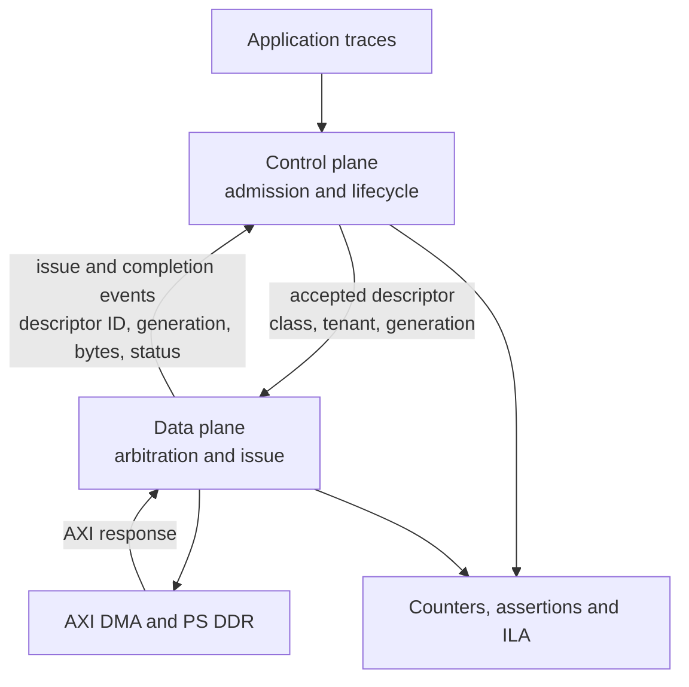

# Decision 004: authorize the SMALLEST two-tenant C+D falsifier. Nothing larger.

24 August 2026. This is not "build integrated C+D". It authorizes a
parameterized two-tenant falsifier for synthesis, post-route analysis and
identical XSim / ZCU104 trace replay. Expansion only after every hard gate
clears.

Supersedes the four problems raised in `REVIEW_integrated_CD.md`, which are
accepted with the corrections below.

---

## A. Corrections to my own review, accepted

### A1. The data plane must NOT retire generations or return credits

My proposed feedback label was "completion, generation retire, credit return".
Wrong on both halves. **The data plane reports tagged events. The control plane
owns every lifecycle transition.** A data plane that retires a generation is a
second mutator of authoritative state.

Credits are not uniformly returned on completion:

| credit | returned when |
|---|---|
| descriptor credit | the descriptor **retires** |
| capacity reservation | the object is **safely released** |
| service / fairness credit | charged on **issue**, replenished by **time or configured service quanta** |

**Returning service credit on completion would double-replenish the token
bucket.** That is a real defect and it would have gone into the RTL.

### A2. My artifact rubric can approve a useless design

A beautifully measured, perfectly reproducible design that loses to tuned AXI
QoS scores about 90 on my rubric with zero usefulness. Not an acceptable gate.
Replaced.

### A3. Four P3 details were overstated

- **24 combinations are LOGICAL, not physical queues.** They do not require 24
  FIFOs or a flat 24-way EDF tree. Hierarchy handles it.
- **The 134-bit entry is NOT inherited.** It exceeded 72 bits largely because of
  a 64-bit verification word and content-addressed sharing metadata. **The
  artifact needs neither.** Prefix dedup and content hashing are removed from
  version one. "Already failed to fit" was a warning carried over from a design
  with different requirements, not a demonstrated failure of this one.
- **"Three ledgers in C plus three in D" describes an OWNERSHIP DEFECT**, not a
  necessary architecture. One source of truth per resource.
- **ILA BRAM depends on probe width and depth, not trigger count.** I said nine
  trigger conditions run against 64 BRAM tiles. My own MEASURED document says
  the opposite: cost is `N x W x D / 32768` and **ADVANCED trigger costs ZERO
  BRAM**. I contradicted `docs/hil/ila_budget.md`.

**Buildability status is therefore UNSCORED AND CAPPED**, pending parameterized
synthesis and post-route implementation. Not "below 14".

### A4. I did not actually register the kill criteria

Saying they are required is not registering them. Frozen in section D below,
before any result exists.

### A5. NEW: "run synthesis" was underspecified, and that invalidated my own workflow

Vivado cannot produce meaningful comparison numbers from conceptual blocks. I
had launched a workflow instructing agents to synthesize "representative
worst-case blocks" with no frozen microarchitecture. Those numbers would have
looked authoritative and meant nothing. **The workflow was stopped.** Synthesis
runs only after section C is frozen, and **synthesis alone cannot establish
timing closure**; post-route is required.

---

## B. The corrected feedback contract

Event fields, all nine mandatory:

| field | purpose |
|---|---|
| descriptor ID | match issue to completion |
| tenant ID | prevent cross-tenant state mutation |
| object type | KV page versus expert object |
| physical index | identify reserved storage |
| generation | reject stale completions |
| issued bytes | charge the correct service account |
| completed bytes | detect partial or failed transfers |
| response status | propagate AXI/DMA errors |
| event type | issue, completion, cancellation, error |

**Reclaim predicate.** An object may be marked reclaimable only when

    refcount == 0  AND  inflight == 0  AND  fill_pending == 0  AND  reserved == 0

**and** every completion carrying the current generation has retired.

### Single-owner table, mirrors permitted for observation only

| resource | sole mutator |
|---|---|
| page / expert capacity | control plane |
| descriptor reservation | control plane |
| tenant fairness balance | scheduler |
| speculative-byte budget | data plane scheduler |
| in-flight transaction count | control plane, updated from data-plane events |
| AXI outstanding count | data plane |

---

## C. FROZEN parameterized microarchitecture for the falsifier

Nothing is synthesized until this is frozen. It is frozen here.

| parameter | value |
|---|---|
| part | xczu7ev-ffvc1156-2-e, ZCU104 |
| tenants | **2** |
| object types | KV page, expert object |
| traffic classes | **mandatory, speculative** (no separate fallback class in v1) |
| reserved mandatory descriptors | 1 |
| AXI masters | 1, 128-bit S_AXI_HP |
| metadata entries | 32 or 64 |
| content hashing / prefix sharing / compression | **NONE** |
| mandatory arbitration | EDF |
| cross-tenant arbitration | deficit accounting |
| speculative issue | only from unreserved capacity |
| feedback | issue and completion events with generation tags |
| target clock | **200 MHz pass condition. 300 MHz is a stretch result, not a gate.** |

Metadata split by access pattern, three RAMs, not one wide entry:

- **lookup RAM**: tag, tenant, object type, physical index
- **lifecycle RAM**: generation, refcount, inflight count, state
- **reservation RAM**: deadline, descriptor ownership

Arbitration hierarchy, not a flat tree:

1. mandatory versus speculative selection
2. EDF among mandatory descriptors
3. deficit or credit arbitration across tenants
4. speculative issue only while reservations remain intact

Synthesis configuration must additionally declare and hold identical across all
variants: AXI width and clock-domain arrangement, descriptor count and width,
page-table depth and associativity, generation/refcount/inflight widths,
arbitration topology, ILA probe width and depth, constraints, Vivado version,
Tcl script and report checksums. Both runs are required: **out-of-context
synthesis per block, and integrated place-and-route** with AXI-facing registers,
RAM placement and ILA.

---

## D. KILL CRITERIA, REGISTERED BEFORE ANY RESULT EXISTS

These bind now. They are not revisable after results arrive.

### D1. Hard correctness kills, stop immediately on any

- cross-tenant lookup or alias
- stale-generation completion modifying current state
- reuse while refcount, inflight, fill, reservation or outstanding I/O is nonzero
- descriptor, reference, capacity or credit underflow or overflow
- admitted mandatory issue-deadline miss **while the declared service envelope
  holds**
- mandatory request blocked by speculative consumption of reserved resources
- AXI protocol assertion failure
- unmatched, duplicated or lost completion

### D2. Implementation kills

- fails post-route at **200 MHz** on the exact device
- WNS negative or TNS nonzero
- any functional or generated clock unconstrained
- unresolved CDC or critical implementation warnings
- design plus its required ILA configuration exceeds the frozen resource budget
- **timing closes only after removing the probes needed to verify the claim**

### D3. Baseline kills, against tuned AXI QoS and lifecycle-aware EDF

- no tested operating region improves offered-load SLO goodput
- improvement exists only because more requests are rejected
- completed throughput falls by more than 10 percent
- mandatory tail latency does not improve
- speculative traffic receives no useful service under non-overload conditions
- the result disappears when baselines get equal queue depth, descriptor
  capacity and admission knowledge

### D4. Primary performance gate, PROPOSED not measured

> At identical offered load and downstream service, improve on-time completions
> per **offered** request by at least **10 percent** over tuned AXI QoS while
> retaining at least **90 percent** of its total completed throughput.

---

## E. Artifact rubric, replacing mine

| criterion | weight |
|---|---:|
| correctness and falsifiability | 25 |
| post-route buildability | 20 |
| board and ILA evidence | 20 |
| **advantage over the strongest tuned baseline** | **20** |
| reproducibility | 10 |
| claim discipline | 5 |

> **GO only at 80/100 or higher, with every hard safety and baseline kill
> criterion passing.**

The research score stays separately reported at **novelty 8/30**. It is never
merged with the artifact score.

---

## F. The central claim the falsifier must be able to break

> Under the declared downstream service envelope, accepted mandatory work is
> issued by its deadline, speculative traffic cannot consume reserved service,
> and no object is reused before lifecycle quiescence.

Falsification path: Python golden model, then identical trace replay in XSim and
on the ZCU104, with counters and ILA triggers on every D1 condition.

## G. Explicitly NOT claimed

No mechanism novelty. No first deadline-aware scheduler, KV manager, MoE traffic
arbiter or FPGA KV controller. No unconditional end-to-end DDR completion
guarantee. No timing non-interference from address isolation. No patent freedom.
The contribution, if it survives, is an open verified reference implementation.
