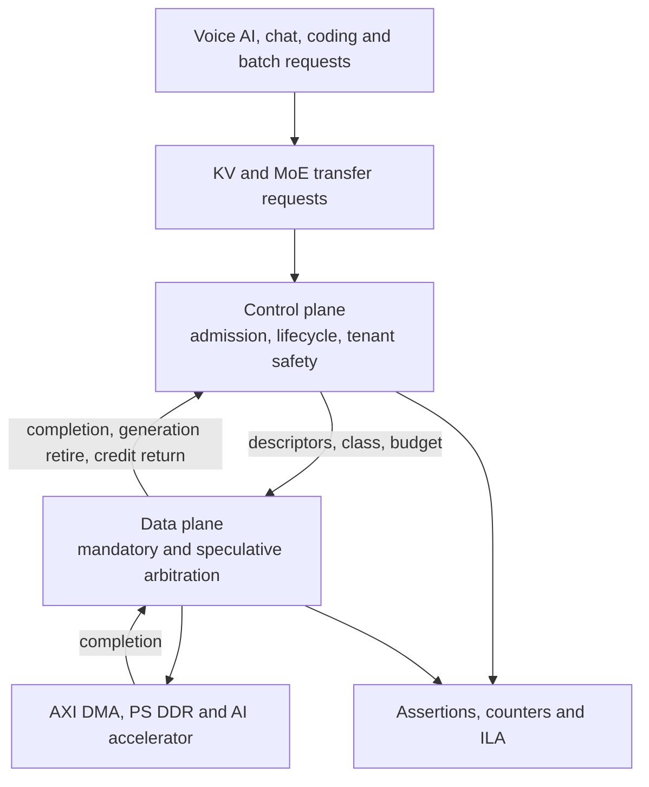

# Review: integrate Candidate C and Candidate D into one implementation project

Reviewing the C+D integration proposal. **Agreed in principle.** The
control-plane / data-plane cut is the right architectural seam, the two-decision
split is correct, and "no candidate remains" was too absolute: it was a ruling
about the novelty gate, not about engineering value.

Four substantive problems before this is committed.

---

## P1. BLOCKING: the diagram omits the feedback path, and that path is the entire counterexample

The proposed flow is `C -> D -> E`, with `C -> F` and `D -> F`. There is **no
edge from the data plane back to the control plane.**

That is the one edge the whole Candidate C pass was about. The counterexample
was a page with `refcount = 0` that still carried in-flight work, where the
earliest legal completion was cycle 4 against a deadline of 3. **The control
plane cannot know a page is quiescent unless the data plane tells it.** Without
a completion and generation-retire path, C's lifecycle ledger is blind exactly
where it was proved to matter, and the integrated design reproduces the bug it
exists to prevent.

Required edges, all three:

    D -> C   transfer completion, so in-flight count decrements
    D -> C   generation retire, so a frame becomes genuinely reclaimable
    D -> C   credit return and speculative-budget replenishment

Corrected flow:

Without `D -> C`, admission decisions are made against stale lifecycle state and
invariant "no eviction while in-flight" cannot be enforced, only hoped for.

## P2. Do NOT rescore the integrated design on the 80-point novelty rubric

The proposal says the combined architecture must be rescored independently.
Agreed that it must be rescored. **But not on that rubric.**

The 80-gate rubric allocates 30 of 100 points to novelty and exists to select a
research flagship. The integrated C+D is being adopted **on the explicit
premise that it is not novel**. Scoring an avowedly-not-novel artifact on a
30-point novelty axis guarantees a score in the 60s and tells us nothing we do
not already know. It would be running the same rejection a third time and
calling it a decision.

An artifact decision needs an artifact rubric. Proposed weights:

| axis | pts | what it scores |
|---|---:|---|
| falsifiability | 25 | are there pre-registered kill criteria, and can the board disprove the claim |
| evidence strength | 25 | what can actually be MEASURED on this board, ILA included |
| buildability | 20 | resources, timing closure, verification state space |
| reproducibility | 15 | deterministic replay, open traces, open RTL |
| usefulness | 10 | would another group adopt or extend it |
| honesty of claim | 5 | is the contribution stated at the altitude the evidence supports |

Novelty is deliberately absent because it has already been adjudicated at 8/30
and is not what this decision is about.

## P3. Feasibility does not carry over, and the numbers point the wrong way

C scored 17/20 on feasibility and **D scored 14/20**. The integration inherits
D's problems and adds its own. The combined state space is not additive:

- 4 tenants x {KV, expert} x {mandatory, fallback, speculative} = **24
  queue-class combinations** to arbitrate
- per-page state: refcount, inflight, fill_pending, generation, tenant,
  reservation, LRU. That is the entry that **already failed to fit in a 72-bit
  URAM row** in SPEC v0.3
- descriptor reservation plus a hard speculative-byte ceiling plus reserved
  fallback descriptors is three separate credit ledgers in the data plane, on
  top of C's three in the control plane
- one 128-bit HP path and one PS DDR4, with no PL SODIMM fitted on this kit
- nine ILA trigger conditions, against a MEASURED budget of 8 probes x 32 bits x
  8192 deep at 64 BRAM tiles

**The honest read is that feasibility for the integrated design starts below
D's 14/20, not at C's 17/20.** A resource and timing estimate is required
before commitment, not after. This is the axis most likely to kill the project
and it is the one the proposal is quietest about.

## P4. The proposal has no kill criteria

Every prior pass carried explicit pre-registered thresholds, and that discipline
is what let A, B, C and D be rejected cleanly rather than argued about. The
integration proposal has eight baselines and a long metrics list but **no
statement of what result would end it.**

Without pre-registered kill criteria an engineering artifact becomes
unfalsifiable: any outcome can be written up as a finding. Required before RTL,
and required in writing:

- if the integrated policy does not beat **tuned AXI QoS** on p99 issue latency
  for mandatory traffic, the controller has no reason to exist
- if the admission rate collapses the way the C pass showed (10 of 24 admitted
  against EDF's 14) without a corresponding goodput win at the declared SLO,
  it is a worse scheduler wearing more logic
- if speculation can ever block mandatory traffic, or fallback reservation can
  be exhausted, that is a safety failure and not a tuning parameter
- if timing does not close at the declared clock with ILA inserted

## Points where the proposal is right and should not be softened

- **The ZCU104 is a controllable memory-system demonstrator, not a pretend
  frontier model.** This matches the feasibility envelope exactly: 4.75 MB
  on-chip against 512 MB for one FP16 context, a factor of 108.
- **Reporting offered, admitted, completed and on-time separately.** This is the
  metric that exposed C's admission trade and it must stay front and centre, not
  be collapsed into a single throughput number.
- **Including tuned AXI QoS as a baseline.** It is the baseline most likely to
  kill the project, which is exactly why it belongs.
- **A and B excluded from the first implementation.** Correct. They add
  progressive-precision complexity to a demonstration that is about contention,
  and both are the most heavily anticipated of the four.
- **Every guarantee conditional on a declared downstream service envelope.**
  Correct and non-negotiable. The PL cannot promise end-to-end DDR completion
  against arbitrary PS and other-PL masters.

## One positioning note, INTERNAL ONLY

The collision matrix records CXL-SpecKV (ACM FPGA 2026) as occupying the FPGA
KV-manager artifact lane. Our own forensic reading of that paper found its
confidence port tied to a constant, no corresponding module in the released RTL,
no testbenches, and a device-utilisation denominator that does not match the
part it names.

**That reasoning is internal and must not be published or hinted at.** It is
recorded here only because it bears on positioning: the artifact lane's
incumbent is weaker than its citation implies, which strengthens the case for
building a verified artifact rather than weakening it. The public position stays
"an open, verified reference implementation", with no comparison drawn to
another group's rigour.
